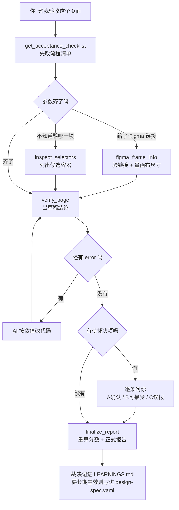

# design-gate 怎么用、怎么跑的

一句话：**把 Figma 的设计稿和浏览器里的真实页面，各自拆成一棵「带样式的元素树」，
然后逐个属性对数字。** 不是让 AI 看截图猜「这里好像差了点」，而是直接给出
「这个按钮宽 310，设计稿要 320，差 10px」。

为什么非得这样：AI 看截图判断像素差不可靠 —— 同一张图问两次可能给两个答案，
而且它说不清差多少。design-gate 把「测量」交给固定代码，AI 只负责读结论、改代码、
再跑一遍。**数字由程序给，改法由 AI 出。**

---

## 一、五个工具，是一条流水线

把 MCP 接进 Trae / Codex / Claude Code 之后，AI 手上多了 5 个工具。它们不是平级的，
得按顺序用：

| 顺序 | 工具 | 大白话 |
|---|---|---|
| 0 · 开始前 | `get_acceptance_checklist()` | 「先看规矩」。返回一份对话流程清单：先问什么、结果怎么分类、什么不许干 |
| 1 · 凑参数 | `figma_frame_info(figmaUrl, figmaSnapshot?)` | 「这链接能打开吗」。也支持宿主已获取的 Figma 快照，不依赖 Token |
| 1 · 凑参数 | `inspect_selectors(webUrl)` | 「页面上有哪些块」。列出候选容器，帮你决定验收哪一块 |
| 2 · 干活 | `verify_page(...)` | 真正跑比对。出**草稿**结论 + 问题清单 + 报告文件 |
| 3 · 收尾 | `finalize_report(jsonPath, decisions)` | 把人的裁决写回去，重算分数，出**正式**报告 |

**草稿和正式的区别是这套东西的关键。** `verify_page` 只能算出「数值上差多少」，
它判断不了「设计稿里有个图标、代码里没有 —— 是漏做了，还是产品后来砍掉了」。
这类问题挂在「待裁决」里等人回答，`finalize_report` 才能据此把它从分数里扣掉或放过。
跳过第 3 步，报告上的分数就是没算完的。

---

## 二、一次完整验收长什么样



大白话版本：

**阶段一 · 凑参数**（协议要求 AI 一次只问一件事，能自己验证的先验证再问）

1. **Figma 链接或快照** → 马上调 `figma_frame_info` 试一下。宿主 Agent 已通过 Figma 连接器拿到原始节点时，传 `figmaSnapshot` 即可，不需要 Token；只有 `design-gate` 自己走 REST API 时才需要 Token。
   它顺手把画布尺寸量出来告诉你后面按多大视口跑 —— 这个是**告知**，不是一个要你回答的问题：
   验收本来就该在设计稿的尺寸下量，换断点才是例外
2. **页面地址** → `http://localhost:3000/xxx`，或者 `file://` 开头的本地文件
3. **验收哪一块** → 不确定就调 `inspect_selectors` 列出来让你挑；整页就填 `body`
4. **有没有规范文件** → 项目里的 `design-spec.yaml`（见第八节）
5. **项目名** → 决定报告存哪、HTML 叫什么名字，可以用中文

**阶段二 · 跑比对**，结果分三堆处理：

- **必须修**（error）：数值明确，AI 直接改代码 → 重跑 `verify_page` → 看数字有没有降下来
- **建议看**（warning）：汇总给你过一眼
- **待裁决**（多了/少了这类）：一条一条念给你，你回 A确认 / B可接受 / C误报

**阶段三 · 出正式报告**：`finalize_report` 应用裁决、重算分数、重出 HTML。
判成「可接受」和「误报」的会记一笔到 `LEARNINGS.md`。

> ⚠️ 一个容易踩的坑：`LEARNINGS.md` 只是**记账本，不是规则**。这次说「可以接受」，
> 下次重跑照样报。想让它永久闭嘴，得写进 `design-spec.yaml` 的 `exemptions`（豁免）
> 或者放宽 `tolerances`（容差）—— 协议里要求 AI 在这一步再问你一次要不要写。

协议里还写死了两条禁令，AI 不许自己绕过去：

- 不许为了让验收通过，偷偷改容差、加白名单
- 不许跳过 error 就宣称做完了；同一个问题盲改超过 3 轮必须停下来说卡在哪

另外协议明确写了：凡是要你做决定的地方（选参数、逐条裁决、要不要改规范），
优先用载体自带的**弹窗/选项面板**来问 —— 点选比在长文本里数条目省事，也不容易漏。
载体没这个能力就退回纯文本一条一条问。

---

## 三、`verify_page` 内部到底做了什么

```
        设计侧                                    实现侧
 ────────────────────────           ──────────────────────────────
 Figma REST API / 离线 JSON          你的页面（无头 Chromium，视口钉死）
          │ 节点树                              │ DOM
          ▼                                     ▼
 ① 容器吸收唯一文本子节点            ② 折叠纯粹包一层的 wrapper
    坐标平移到根节点原点                 抄 bbox + computedStyle
          │                                     │
          └────────► 同一种 StyleNode 树 ◄──────┘
                            │
             ③ 配对：data-df-id ▸ 文本内容 ▸ 几何位置
                            │
             ④ 逐属性对数字（零 AI 参与，全部由固定代码算）
                            │
          ┌─────────────────┼─────────────────┐
          ▼                 ▼                 ▼
   ⑤ 元素证据小图      ⑥ 图上标记钉      ⑦ CSS 修复清单
          └─────────────────┼─────────────────┘
                            ▼
                   ⑧ 算分 + 门禁判定
                            ▼
      <项目名>验收.html  ·  result.json  ·  fixes.txt
```

一步步说：

**① 拿设计真值。** 用 Figma REST API 读节点树（或者读离线缓存的 JSON），转成统一的
`StyleNode` 树，只留验收关心的字段：位置尺寸、颜色、字体、圆角、边框、间距。
顺手做两件事 —— 容器只有一个文本子节点时把文本「吸」进容器（对齐 DOM 的习惯：
文字是挂在带样式的元素上的）；所有坐标平移到根节点原点（消掉「设计稿在画布上摆在哪」
这种无关差异）。

**② 拿实现真值。** playwright-core 起一个**无头浏览器**打开页面截整图，同时注入一段脚本
遍历 DOM，把每个元素的 `getBoundingClientRect()` 和 `getComputedStyle()` 抄下来，
折叠掉那些纯粹用来包一层的 wrapper，输出**同样形状**的树。两侧结构模型对齐，
后面才谈得上逐属性比。

用哪个浏览器、开多大视口、带不带登录态，这三件事都是刻意钉死的 —— 见本节末尾。

**为什么必须真开浏览器**：行高的实际 px、字体 fallback 之后真正生效的那一个、
布局之后的最终几何、伪元素的 `content` —— 这些只有渲染完才存在，静态读 CSS 读不出来。

**③ 两棵树配对。** 三种信号，从强到弱：`data-df-id` 手工标注（你在代码里写了它就直连，
最准）→ 文本内容相同 → 几何位置贪心匹配。还加了一层「类别相容」约束，
免得把「锁图标」配到恰好同位的 checkbox 容器上 —— 一次错配会同时污染两条结论
（假偏差 + 假缺失）。每条结论都带着这对的置信度（`matchScore`）落进报告，配得勉强的
会写成「配对置信度仅 36%：请先确认这个元素就是设计稿里的 X」并把结论降级为待确认；
整轮匹配整体可疑时，门禁状态才升成 `NEEDS_REVIEW`。

**④ 逐属性对数字。** 报告上所有结论都来自这一步，没有任何 AI 参与。查什么见第四节。

**⑤ 裁元素证据小图。** 按元素单独裁小图（错误优先，最多 24 个），路径记进
`result.json`。⚠️ 当前 HTML 报告还没有引用这些小图，设计侧的 `d-*.png` 也没真正产出 ——
这一步现在只落盘、不进报告，属于待接线的半成品。


**⑥ 合成图上标记钉。** 把同一个元素上的多条结论合成**一枚**角标，钉到大图对应位置。
所以图上一个框 = 一处问题元素，不是一条结论。

**⑦ 生成修复代码块。** 把能直接改的结论翻译成 CSS 声明，按元素分组，写进 `fixes.txt`
（报告里也内嵌一份，可一键复制）。同一属性有多条时 token 版优先 ——
`background-color: var(--primary)` 同时满足数值和规范两条要求。

**⑧ 算分与门禁。** 见第五节。

### 量在哪个浏览器

按这个顺序找，找到第一个能起来的就用：

| 顺位 | 从哪来 | 说明 |
|---|---|---|
| 1 | `DESIGN_GATE_BROWSER=<可执行文件路径>` | 显式指定。**载体自带浏览器就填这里** —— 很多 agent 工具（Trae / VS Code 系）都装了一份 Chromium，路径填进来就不必再下一个 |
| 2 | Playwright 托管的 Chromium | 扫 `PLAYWRIGHT_BROWSERS_PATH` 和各平台的 `ms-playwright` 缓存目录；同目录多版本取最新，完整 Chromium 优先于 headless shell |
| 3 | 系统 Chrome（`channel: "chrome"`） | 你日常在用的那个 |
| 4 | 常见安装路径 | Chrome / Edge / Chromium / Arc 的默认位置 |

顺位 1 **不兜底**：显式指定了却起不来就直接报错。静默换一个浏览器，等于让你拿着
错版本量出来的数字去找差异。

顺位 2 排在系统 Chrome 前面是有意的：托管副本版本固定、没有扩展、没有用户配置，
两次验收之间不会因为浏览器自动升级、或者某个扩展往页面里注入样式而量出不同的数。
想要这份稳定性就装一下：`npx playwright install chromium`（约 120MB，不装也能跑）。

**一律无头、一律我们自己起。** 不复用你正在用的那个窗口 —— 原因见下面视口那段。

### 视口：默认跟着设计稿走

`verify_page` 的 `viewport` 留空时，宽度取**设计稿 frame 的宽**（量不出来退 1920），
高度取 frame 高、超过 1200 的长页面画板退回 1080。要验另一个断点时才显式传 `WxH`。

- **宽度必须等于设计稿宽**：页面的 rem 换算和媒体查询都按宽度分档。宽度错了整页比例
  就错，报告里每个几何数字都跟着偏 —— 而那个偏差跟实现没有半毛钱关系。
- **高度不跟长画板**：1920×3200 的长图拿去当视口高，`100vh` 会被撑成 3200px，
  凭空造出一批假偏差。
- **`window.screen` 跟视口一起仿真**，`deviceScaleFactor` 固定 2。大屏后台很爱写
  `html{font-size:screen.width/19.2}` —— 它读的是**屏幕宽**而不是视口宽。只钉视口不钉
  screen 的话，物理屏幕多大页面就按多大排版。

  这就是「headful 窗口不能拿来测量」的原因：真实窗口的宽度和 DPR 是物理事实，
  Playwright 的视口仿真在那种上下文里**不生效**。Mac 上一个 2133px@1.8x 的窗口，
  会让上面那行适配把整页放大 11.1%（根字号量出来是 111.09px 而不是 100px），
  此后报告里每个几何数字，都是在一个从未处于 1920 的页面上量出来的。
  `test/viewport.test.ts` 就是锁这一条的。

### 页面要登录才能看：`DESIGN_GATE_CDP`

内网后台通常得先登录。做法是**借凭据，不借窗口**：

```bash
# 你自己的 Chrome，带独立 user-data-dir 起一个调试端口，然后在里面登录目标页面
"/Applications/Google Chrome.app/Contents/MacOS/Google Chrome" \
  --remote-debugging-port=9222 --user-data-dir=/tmp/dg-profile
```

然后给 design-gate 配 `DESIGN_GATE_CDP=http://127.0.0.1:9222`。它会连上去，
把 Cookie、目标源那个标签页的 `localStorage` / `sessionStorage`、UA 抄一份，
**立刻断开**，再把这些注进我们自己起的无头上下文里。全程只读，不动你任何标签页；
断开也不会关掉你那个浏览器。

一个要注意的点：很多后台把 token 放在 `localStorage` 里，而 storage 只能在**该源的
页面上下文**里读。所以那个 Chrome 里得先打开并登录目标页面 —— 没有同源标签页时只能
借到 Cookie，工具会在 stderr 上警告一句，否则你会安静地拿到一份「登录已过期」的空页面报告。

---

## 四、到底检查哪些东西

| 类别 | 看什么 | 什么算错 |
|---|---|---|
| 位置与尺寸 | 相对父级的内偏移、与前一个兄弟的间隔、宽高、gap | 差 ≥2px 警告，≥8px 错误 |
| 颜色 | 背景色、文字色 | CIEDE2000 色差 ΔE ≥2.3 警告，≥5 错误（2.3 差不多是人眼刚能分辨的量） |
| 字体排版 | 字号、字重、字体族、行高 | 字号差 ≥0.6px 警告 / ≥1.5px 错误；字重差 >100 错误；行高差 ≥2px 警告 |
| 圆角 | 四个角的半径 | 差 ≥1px 警告，≥3px 错误 |
| 边框 | 线宽、线色 | 线宽差 ≥0.75px 警告 / ≥1.5px 错误 |
| 间距栅格 | gap / padding 是不是 4、8 的倍数 | 不在倍数上 → 警告 |
| 颜色规范（token） | 页面上的色值有没有命中 tokens 表 | 没命中 → 错误，并给出最接近的 `var(--xxx)` |
| 缺失与多余 | 设计有代码无 / 代码有设计无 | 缺失 → 错误；多余 → 警告（这类基本都要人裁决） |

上面的阈值全部可以在 `design-spec.yaml` 里改，表里写的是默认值。

### 两个刻意的「不查」

- **纯文本节点不比宽高。** Figma 的文本框紧贴文字，DOM 里的 `<p>` 默认撑满整行，
  宽高天然对不上，报出来全是噪声。文本只比字体属性和位置。
- **位置用相对关系，不用绝对坐标。** 父容器往右挪了 10px，它里面 20 个后代的绝对坐标
  全都差 10px —— 按绝对坐标报，一处失误会变成 21 条结论。所以位置比的是「相对父级的
  内偏移」和「与前一个兄弟的间隔」；子元素整体同向偏移时只报父容器那一条，
  并附一句「根因在本容器的内边距或对齐方式，改这一处即可」。

### 三处刻意的去重

1. 容器 gap 写错时，后面每个兄弟本来都会各报一条间隔差 → 抑制成一条（子元素另有偏移的那份仍保留）
2. 几何已经报了「gap 应为 12、实际 10」→ 栅格检查不再补一句「10 不在 4/8 上」
   （改成 12 顺带就落回栅格了，两条结论只有一处可改）
3. 但 **token 检查故意不去重** —— 「色值错了」和「这个色值还是硬编码的」是两件事，
   而后者带的 `应使用 var(--primary)` 才是两条里更可执行的那条

---

## 五、分数怎么算，什么叫通过

分数 = **干净元素的占比**，不是扣分制：

```
分数 = 100 × ( 1 − (出错元素 × 1 + 只有警告的元素 × 0.4) ÷ 被检查的元素总数 )
```

同一个元素上叠 5 条结论，只按最严重的那条算**一次** —— 免得「这个元素被查得更细」
被读成「这个元素问题更严重」。

之所以不用「100 减 error×10」那种扣分制：那个公式在 10 个 error 之后恒等于 0，
真实页面从 56 条修到 12 条，分数一动不动，修复过程完全读不出进展。

门禁三档：

- 有任何 error → **FAIL**
- 有警告的元素超过 3 个 → **FAIL**（预算按「元素」算，不按「警告条数」算）
- 匹配质量不佳且有问题 → **NEEDS_REVIEW**（结论可能是配错导致的，先看一眼）
- 否则 → **PASS**

---

## 六、报告长什么样、怎么看

一个 HTML 文件，双击就开，不用起服务、不用联网，只做浅色模式。注意它**不是单文件**：
截图是按相对路径引的同目录 `actual.png` / `design.png`，转发报告要把整个目录一起打包。


```
┌──────────────────────────────────────────────────────────────────┐
│ (24)  定价卡片 设计验收报告  ❌未通过                            │ 分数环 + 结论
│  file://…/pricing · 视口 1920x1080 · 匹配 9 对 · 错误 11 / 警告 4│
│  全部9  ●颜色2  ●字体排版2  ●位置与尺寸2 …  ☑标注 ☑编号  切换视图│ 筛选 + 开关
├────────────────────────────────────┬─────────────────────────────┤
│  ①②③ 红框=错误 橙框=警告            │  9 / 9 处问题元素           │
│                                    │ ┌─────────────────────────┐ │
│   设计稿 ⇄ 实现   滑块对拉          │ │① .btn                   │ │
│   也能「只看设计 / 只看实现 /       │ │  宽 310 → 应 320  Δ10px │ │ 右侧滚动
│   半透明叠」四种看法                │ │  背景 #2536eb 是硬编码  │ │
│                                    │ └─────────────────────────┘ │
│   鼠标移到角标 → 浮出这处的摘要      │ ┌─────────────────────────┐ │
│   移到卡片 → 图上对应框高亮、其余弱化│ │② .desc 文字色…          │ │
├────────────────────────────────────┤ └─────────────────────────┘ │
│ 🛠 全量修复代码            [复制]   │  …                          │
│ html>body>.pricing-card {          │  ─ 图上无标注 · 2 处 ─      │
│   width: 320px; /* 现:310px */     │  （实现里找不到对应元素）   │
└────────────────────────────────────┴─────────────────────────────┘
```

- **左上那张图固定一屏**，不用滚。实现截图和设计稿截图叠在一起，四种看法自由切；
  按严重度画框（红=错误 橙=警告），左上角带编号角标；标注和编号能整体关掉看干净的图。
- **右侧卡片一处元素一张**，编号和图上角标一一对应，滚动看。顶上一排分类药丸可以筛，
  筛完左右同步只留相关的那些，顶上的计数跟着变。筛「颜色」时框色也会跟着切成这一类的
  严重度 —— 免得一个元素因为几何是错误就顶着红框，替另一类问题背锅。
- **左下修复代码块**是全量的，**不随筛选变化** —— 复制出去交给 AI 的东西必须是完整的。
- 设计稿里有、页面上找不到的问题没法在图上画框，单独列在右侧末尾的「图上无标注」区。
- 裁决过的和被豁免的不会凭空消失，折叠在末尾的「已豁免 / 误报 / 信息项」里（不计分），
  带着当初判成了什么、理由是什么。


---

## 七、跑完留下哪些文件

```
reports/
└── 定价卡片/                  ← 目录名 = 项目名，中文可以
    ├── 定价卡片验收.html       ← 给人看的报告，双击就开
    ├── result.json            ← 给程序/AI 看的完整结论
    ├── fixes.txt              ← 纯 CSS 修复清单，可直接喂 AI
    ├── actual.png             ← 实现页面整图
    ├── design.png             ← 设计稿整图（线上模式才有）
    └── crops/                 ← 元素级证据小图（左右各一份）
```

项目名从哪来，依次退让：`--name` / MCP 的 `projectName` → 设计稿 frame 名 →
两个都没有才退回 `reports/<时间戳>/report.html`。

`result.json` 的文件名固定不动，因为 `finalize_report` 只拿到这个路径，靠它找回上一轮结论；
HTML 的名字是从 json 里的项目名反推的，所以正式报告会**覆盖**草稿，不会在旁边多留一份半成品。

同一个项目复验 → **覆盖同一个目录**。要留档就换个项目名，或者用 `--out` 指定目录。
（这条有教训：旧行为每跑一次留一个时间戳目录，攒到过 44MB 没人看的历史。）

---

## 八、`design-spec.yaml`：验收的「法律」

所有判定都来自这个文件，不是 AI 的主观感受。复制 `templates/design-spec.yaml`
到项目根目录改。四块内容：

| 块 | 干什么 | 例子 |
|---|---|---|
| `grid` | 定间距栅格 | `grid: [4, 8]` —— gap / padding 必须是 4 或 8 的倍数 |
| `tolerances` | 定每类偏差多少算警告、多少算错误 | `geometry: { warn: 2, error: 8 }` |
| `requireTokens` + `tokens` | 色值白名单，防硬编码 | 页面出现表外颜色 → 错误，并推荐最接近的 token |
| `exemptions` | 白名单豁免 | 第三方图表、装饰元素；命中后降级为 info 并写明理由 |

改这个文件是**唯一**让验收结论正当变化的方式 —— 也正是因此，协议禁止 AI 自己动它。
经验沉淀的完整链路是：人工裁决「可接受」→ 写进 `exemptions` 或调容差 → 规则固化、结果可复现。

---

## 九、不接 MCP 也能用（CI 门禁）

同一个引擎，命令行入口：

```bash
export FIGMA_TOKEN=你的figma个人访问令牌   # 仅独立 REST API 模式需要
node dist/cli.js --figma "https://www.figma.com/design/KEY/File#node-id=12-34" --web http://localhost:3000/pricing --selector ".pricing-card" --name "定价卡片" --spec ./design-spec.yaml
```

退出码就是门禁：**PASS=0 / FAIL=1 / 异常=2**，可以直接挂进 CI。

想先确认装好了没有、又不想连 Figma，跑离线冒烟（用仓库里的 fixture）：

```bash
npm run smoke
```

---

## 十、跑之前要有什么

- Node ≥ 20
- 一个能起来的 Chromium 内核浏览器 —— 载体自带的（`DESIGN_GATE_BROWSER` 指路径）、
  `npx playwright install chromium` 装的托管副本、或者系统里的 Chrome / Edge / Chromium，
  任选一个，三条路的优先级见第三节
- 宿主 Agent 已拿到 Figma 原始节点时，优先传 `figmaSnapshot`，不需要 Token。
  只有 `design-gate` 独立根据 URL 调 Figma REST API 时才需要 `FIGMA_TOKEN`；喂离线 JSON（`--figma-json`）时也不需要
- 设计稿必须是 Design file，Draft 状态的文件 Figma API 读不到

---

## 十一、已知边界

- 复杂嵌套布局的多层 padding 累积，目前只报到父容器这一层
- 渐变 / 图片填充还没做（计划回退到局部截图做视觉比对）
- hover / focus / disabled 这些状态不查，只看默认态
- 多断点（比如同时验 375 和 1920）要分两次跑，第二次显式传 `viewport`
- 同向偏差还没聚类（N 个元素一起偏了 → 本该给一条 token 级的修复建议）
